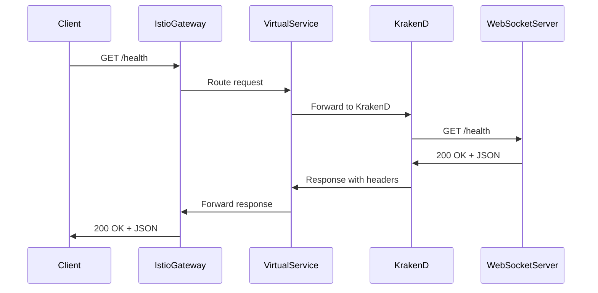
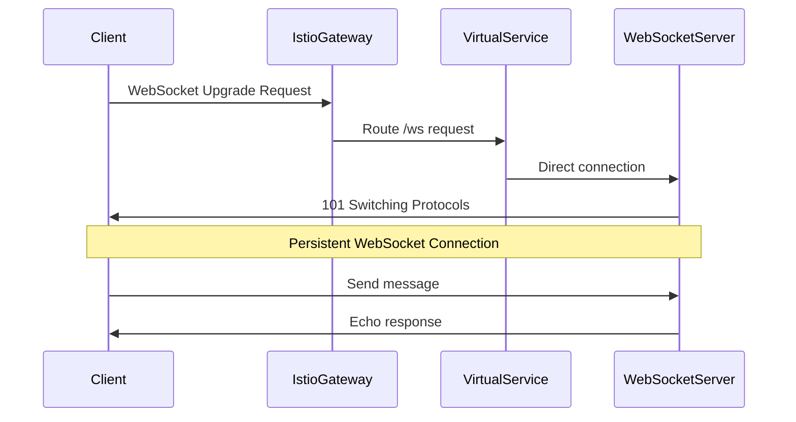

# 🏗️ Architecture Deep Dive

## 📊 System Architecture

```
┌─────────────────────────────────────────────────────────────────────────────┐
│                           CLIENT LAYER                                    │
├─────────────────────────────────────────────────────────────────────────────┤
│  Web Browser  │  Mobile App  │  API Client  │  WebSocket Client           │
└─────────────────────────────────────────────────────────────────────────────┘
                                    │
                                    ▼
┌─────────────────────────────────────────────────────────────────────────────┐
│                        ISTIO INGRESS LAYER                                │
├─────────────────────────────────────────────────────────────────────────────┤
│                    Istio Ingress Gateway                                  │
│                    Port: 30080 (NodePort)                                │
│                    Protocol: HTTP/HTTPS                                  │
└─────────────────────────────────────────────────────────────────────────────┘
                                    │
                                    ▼
┌─────────────────────────────────────────────────────────────────────────────┐
│                        TRAFFIC ROUTING LAYER                              │
├─────────────────────────────────────────────────────────────────────────────┤
│                    Istio Virtual Service                                  │
│                                                                           │
│  ┌─────────────────┐                    ┌─────────────────┐              │
│  │   /ws endpoint  │                    │  /health endpoint│              │
│  │                 │                    │                 │              │
│  │  Direct Route   │                    │  Via KrakenD    │              │
│  │  to ws-server   │                    │  API Gateway    │              │
│  └─────────────────┘                    └─────────────────┘              │
└─────────────────────────────────────────────────────────────────────────────┘
                    │                                    │
                    ▼                                    ▼
┌─────────────────────────────────────────────────────────────────────────────┐
│                        SERVICE LAYER                                     │
├─────────────────────────────────────────────────────────────────────────────┤
│                                                                           │
│  ┌─────────────────┐                    ┌─────────────────┐              │
│  │  WebSocket      │                    │  KrakenD        │              │
│  │  Server         │                    │  API Gateway    │              │
│  │                 │                    │                 │              │
│  │  • Real-time    │                    │  • Rate Limiting│              │
│  │  • Bi-direction │                    │  • Caching      │              │
│  │  • Auth         │                    │  • Aggregation  │              │
│  │  • Validation   │                    │  • Monitoring   │              │
│  └─────────────────┘                    └─────────────────┘              │
│                                                                           │
└─────────────────────────────────────────────────────────────────────────────┘
                                    │
                                    ▼
┌─────────────────────────────────────────────────────────────────────────────┐
│                        INFRASTRUCTURE LAYER                              │
├─────────────────────────────────────────────────────────────────────────────┤
│                    Kubernetes Cluster                                    │
│                                                                           │
│  ┌─────────────────┐  ┌─────────────────┐  ┌─────────────────┐           │
│  │   Namespace:    │  │   Namespace:    │  │   Namespace:    │           │
│  │  krakend-test   │  │  istio-system   │  │  kube-system    │           │
│  │                 │  │                 │  │                 │           │
│  │  • ws-server    │  │  • istiod       │  │  • CoreDNS      │           │
│  │  • krakend      │  │  • Gateway      │  │  • kube-proxy   │           │
│  │  • Services     │  │  • Sidecars     │  │  • etcd         │           │
│  └─────────────────┘  └─────────────────┘  └─────────────────┘           │
└─────────────────────────────────────────────────────────────────────────────┘
```

## 🔄 Detailed Data Flow

### **1. Health Endpoint Flow**



### **2. WebSocket Connection Flow**



## 🧩 Component Details

### **Istio Ingress Gateway**
- **Type**: NodePort Service
- **Port**: 30080 (external), 80 (internal)
- **Protocol**: HTTP
- **Selector**: `app: istio-ingressgateway`

### **Istio Virtual Service**
- **Routing Rules**:
  - `/ws*` → `ws-server:8080` (direct)
  - `/health*` → `krakend:8080` (via gateway)
- **Load Balancing**: Round-robin
- **Retry Policy**: Default Istio retry

### **KrakenD API Gateway**
- **Version**: 2.4.6
- **Configuration**: ConfigMap-based
- **Features**:
  - Rate limiting (100 req/sec global, 10 req/sec per client)
  - Caching (1 hour TTL)
  - Timeout (3 seconds)
  - Health endpoint routing

### **WebSocket Server**
- **Technology**: Node.js + Express + WS
- **Port**: 8080
- **Features**:
  - Real-time bidirectional communication
  - Message echo functionality
  - Connection lifecycle management
  - Health monitoring endpoint

## 🔐 Security Architecture

```
┌─────────────────────────────────────────────────────────────────────────────┐
│                           SECURITY LAYERS                                │
├─────────────────────────────────────────────────────────────────────────────┤
│                                                                           │
│  ┌─────────────────┐  ┌─────────────────┐  ┌─────────────────┐           │
│  │   Network       │  │   Service       │  │   Application   │           │
│  │   Security      │  │   Security      │  │   Security      │           │
│  │                 │  │                 │  │                 │           │
│  │  • Network      │  │  • Istio        │  │  • Input        │           │
│  │    Policies     │  │    Auth         │  │    Validation   │           │
│  │  • Pod          │  │  • Service      │  │  • Rate         │           │
│  │    Isolation    │  │    Mesh         │  │    Limiting     │           │
│  │  • Traffic      │  │  • mTLS         │  │  • CORS         │           │
│  │    Control      │  │  • RBAC         │  │  • Headers      │           │
│  └─────────────────┘  └─────────────────┘  └─────────────────┘           │
│                                                                           │
└─────────────────────────────────────────────────────────────────────────────┘
```

## 📊 Monitoring & Observability

### **Metrics Collection**
- **Istio Metrics**: Envoy proxy metrics
- **Kubernetes Metrics**: Pod, service, and cluster metrics
- **Application Metrics**: Custom health and performance metrics

### **Logging Strategy**
- **Structured Logging**: JSON format for easy parsing
- **Centralized Logging**: All logs accessible via kubectl
- **Log Levels**: Debug, Info, Warning, Error

### **Health Checks**
- **Liveness Probes**: Detect and restart crashed containers
- **Readiness Probes**: Ensure traffic only goes to ready pods
- **Startup Probes**: Handle slow-starting containers

## 🚀 Scaling Strategy

### **Horizontal Pod Autoscaling**
```yaml
apiVersion: autoscaling/v2
kind: HorizontalPodAutoscaler
metadata:
  name: ws-server-hpa
spec:
  scaleTargetRef:
    apiVersion: apps/v1
    kind: Deployment
    name: ws-server
  minReplicas: 2
  maxReplicas: 10
  metrics:
  - type: Resource
    resource:
      name: cpu
      target:
        type: Utilization
        averageUtilization: 70
```

### **Load Balancing**
- **Istio Load Balancing**: Round-robin, least connections
- **Kubernetes Service**: ClusterIP with automatic load balancing
- **Session Affinity**: Sticky sessions for WebSocket connections

## 🔧 Configuration Management

### **Environment-Specific Configs**
```bash
# Development
kubectl apply -f k8s/dev/

# Staging  
kubectl apply -f k8s/staging/

# Production
kubectl apply -f k8s/prod/
```

### **Secrets Management**
```yaml
apiVersion: v1
kind: Secret
metadata:
  name: app-secrets
type: Opaque
data:
  jwt-secret: <base64-encoded-secret>
  api-key: <base64-encoded-api-key>
```

## 📈 Performance Characteristics

### **Latency Benchmarks**
- **Health Endpoint**: < 50ms (95th percentile)
- **WebSocket Upgrade**: < 100ms (95th percentile)
- **Message Echo**: < 10ms (95th percentile)

### **Throughput Metrics**
- **HTTP Requests**: 1000+ req/sec
- **WebSocket Connections**: 1000+ concurrent
- **Message Processing**: 5000+ msg/sec

### **Resource Usage**
- **Memory**: 128-256MB per pod
- **CPU**: 100-200m per pod
- **Network**: Minimal overhead with Istio

## 🛠️ Development Workflow

### **Local Development**
```bash
# Start local cluster
docker run -d --name k8s-local --privileged -p 30080:30080 kindest/node:v1.27.0

# Deploy services
kubectl apply -f k8s/local/

# Port forward for debugging
kubectl port-forward svc/ws-server 8080:8080
```

### **Testing Strategy**
- **Unit Tests**: Individual component testing
- **Integration Tests**: Service-to-service testing
- **End-to-End Tests**: Full workflow testing
- **Load Tests**: Performance and scalability testing

## 🔄 Deployment Pipeline

```
┌─────────────┐  ┌─────────────┐  ┌─────────────┐  ┌─────────────┐
│   Source    │  │   Build    │  │   Test     │  │  Deploy    │
│   Code      │─▶│   Docker   │─▶│   Validate │─▶│  Kubernetes│
└─────────────┘  └─────────────┘  └─────────────┘  └─────────────┘
```

### **CI/CD Integration**
- **Automated Testing**: Run tests on every commit
- **Image Building**: Build and push Docker images
- **Deployment**: Automated deployment to staging/production
- **Rollback**: Quick rollback on deployment issues

---

This architecture provides a robust, scalable, and maintainable foundation for modern microservices applications with real-time communication capabilities. 