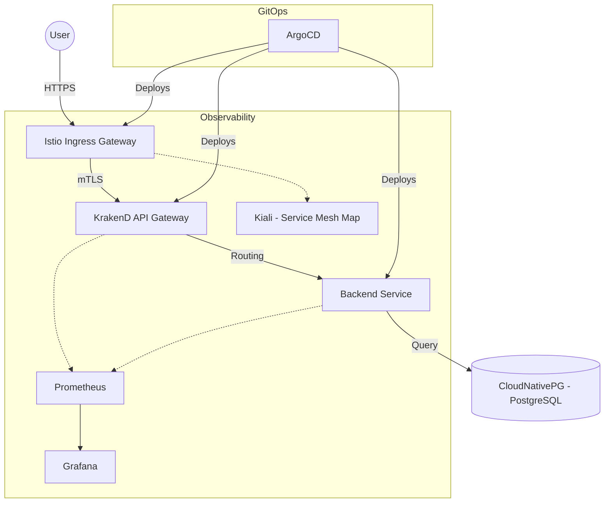

# Kubernetes Service Mesh with Istio and KrakenD API Gateway

This project demonstrates a production-ready, cloud-native infrastructure setup leveraging Kubernetes, Istio (Service Mesh), KrakenD (API Gateway), and ArgoCD (GitOps). It provides a secure, scalable, and observable environment for modern microservices.

## 🏗️ Architecture Overview

The system follows a layered architecture to ensure separation of concerns, security, and high performance.



### 🛰️ Request Flow
1. **Entry**: External traffic enters through the **Istio Ingress Gateway**.
2. **Security & Routing**: Istio handles TLS termination and routes traffic to the **KrakenD API Gateway**.
3. **API Aggregation**: KrakenD performs request aggregation, authentication, and rate limiting before forwarding requests to the appropriate backend services.
4. **Service-to-Service**: Internal communication between KrakenD and backends is secured via **Istio mTLS**.
5. **Persistence**: Data is managed by **CloudNativePG**, a highly available PostgreSQL operator for Kubernetes.

---

## 🚀 Key Features & Benefits

| Feature | DevOps Benefit |
| :--- | :--- |
| **API Gateway (KrakenD)** | Unified entry point, request aggregation, and ultra-high performance (stateless). |
| **Service Mesh (Istio)** | Zero-trust security (mTLS), traffic shadowing, canary deployments, and circuit breaking. |
| **GitOps (ArgoCD)** | Declarative "Infrastructure as Code" (IaC) with automated drift detection and self-healing. |
| **PostgreSQL Operator (CNPG)** | Automated backups, failover, and scaling of database clusters. |
| **Deep Observability** | Real-time traffic visualization (Kiali), metrics (Prometheus/Grafana), and tracing. |

---

## 🌟 Significance of this Project

This architecture is not just a collection of tools; it represents a **Modern DevOps Blueprint** for scaling microservices. Its significance lies in:
- **Zero Trust by Default**: It demonstrates how to move away from perimeter-based security to identity-based service-to-service security (mTLS).
- **Decoupling Concerns**: By separating API Gateway (KrakenD), Service Mesh (Istio), and Application logic, it allows for independent scaling and lifecycle management.
- **Operational Excellence**: Full GitOps automation with ArgoCD ensures that the infrastructure is reliable, reproducible, and self-healing.

---

## 🎯 Real-World Use Cases

### 1. Enterprise Microservices Gateway
Manage hundreds of microservices with a single, high-performance entry point. KrakenD handles the heavy lifting of request aggregation, while Istio ensures secure internal communication.

### 2. Modernizing Legacy APIs
Wrap legacy backend systems with KrakenD to provide modern JSON/REST interfaces, while securing the internal traffic with Istio policies without changing the legacy code.

### 3. High-Security SaaS Platforms
Enforce strict traffic isolation and compliance requirements (like HIPAA or PCI-DSS) using Istio's authorization policies and mTLS encryption.

### 4. Traffic Engineering & Resilience
Perform complex traffic routing like **Canary Deployments**, **Blue/Green**, and **Traffic Shadowing** (Mirroring) to test new features in production without impacting users.

---

## 🔀 Multi-Revision Istio (Canary Upgrades)

This project demonstrates a advanced DevOps pattern: **Running multiple Istio control planes (revisions) simultaneously** in the same cluster. This is essential for zero-downtime service mesh upgrades.

### How it Works in this Project:
1. **Revision 1.25.0**: Deployed in the `istio-system` namespace.
2. **Revision 1.27.0**: Deployed in the `cluster-infra` namespace.

### Benefits of this Setup:
- **Safe Upgrades**: Test a new Istio version on a small subset of services before upgrading the entire mesh.
- **Isolation**: Prevent issues in one control plane from affecting the entire cluster.
- **Discovery Selectors**: The 1.27.0 revision uses `discoverySelectors` to only manage specific namespaces, reducing control plane overhead.

**To transition a service to the new revision:**
Simply update the namespace label:
```bash
# From old version
kubectl label namespace my-app istio-injection=enabled --overwrite
# To new version
kubectl label namespace my-app istio.io/rev=1-27-0 --overwrite
```

---

## 🛠️ Core Components

### 🛡️ Istio Service Mesh
Istio provides a dedicated infrastructure layer for service-to-service communication.
- **Traffic Management**: Fine-grained control over traffic routing (A/B testing, Canary).
- **Security**: Strong identity-based authentication and authorization with mTLS by default.
- **Policy Enforcement**: Rate limiting and access control at the mesh level.

### ⚡ KrakenD API Gateway
KrakenD acts as the front door for your APIs, designed for extreme performance.
- **Middleware Integration**: Custom plugins for auth, logging, and metrics.
- **Efficient Aggregation**: Reduce client-side round trips by merging multiple backend responses into one.

### 🔄 ArgoCD (GitOps)
Continuous delivery for the entire stack.
- **State Synchronization**: Keeps the cluster state in sync with the Git repository.
- **Rollback Capabilities**: Easy rollback to any git commit.

---

## 🏁 Getting Started

### Prerequisites
- A Kubernetes cluster (v1.28+)
- `kubectl`, `helm`, and `base64` installed locally.

### Installation Steps

1. **Clone the Repository**:
   ```bash
   git clone https://github.com/your-repo/k8_istio_krakend.git
   cd k8_istio_krakend
   ```

2. **Install ArgoCD**:
   Bootstrap the cluster with ArgoCD to manage all other components:
   ```bash
   ./scripts/install-argocd.sh
   ```

3. **Verify Deployment**:
   Get the ArgoCD admin password:
   ```bash
   kubectl -n argocd get secret argocd-initial-admin-secret -o jsonpath='{.data.password}' | base64 -d
   ```
   Access the dashboard and ensure the `root` application is in a **Synced** state.

---

## 📈 Monitoring & Maintenance

- **Kiali Dashboard**: Visualize service dependencies and traffic health.
- **Grafana**: Monitor cluster performance, KrakenD throughput, and Istio telemetry.
- **CloudNativePG**: Use `kubectl-cnpg` plugin to manage database upgrades and backups.

---

## 🛡️ DevOps Best Practices
- **Security-First**: Every internal connection is encrypted with mTLS.
- **Declarative Everything**: No manual `kubectl apply`. Everything is managed via Git and ArgoCD.
- **Scalable by Design**: All components are configured with HPA (Horizontal Pod Autoscaler) where applicable.

---

## 🔒 Secret Management

### Current Strategy (Development)
In this experiment, secrets (e.g., PostgreSQL credentials) are stored directly as Kubernetes `Secret` resources for simplicity and demonstration.
> [!CAUTION]
> Hardcoding or directly committing secrets to Git is NOT recommended for production environments.

### Production Strategy (DevOps Recommendation)
For a production-grade deployment, we recommend using an **External Secret Store** (HashiCorp Vault, AWS Secrets Manager, Google Secret Manager) integrated via the [External Secrets Operator (ESO)](https://external-secrets.io/).

**Key Advantages:**
1. **Centralized Management**: Manage all application secrets from a single, secure vault.
2. **Dynamic Rotation**: Automatically rotate secrets without manual intervention or pod restarts.
3. **Audit Trails**: Detailed logs of who accessed which secret and when.
4. **Enhanced Security**: Secrets never live in Git and are injected into the cluster only when needed.
