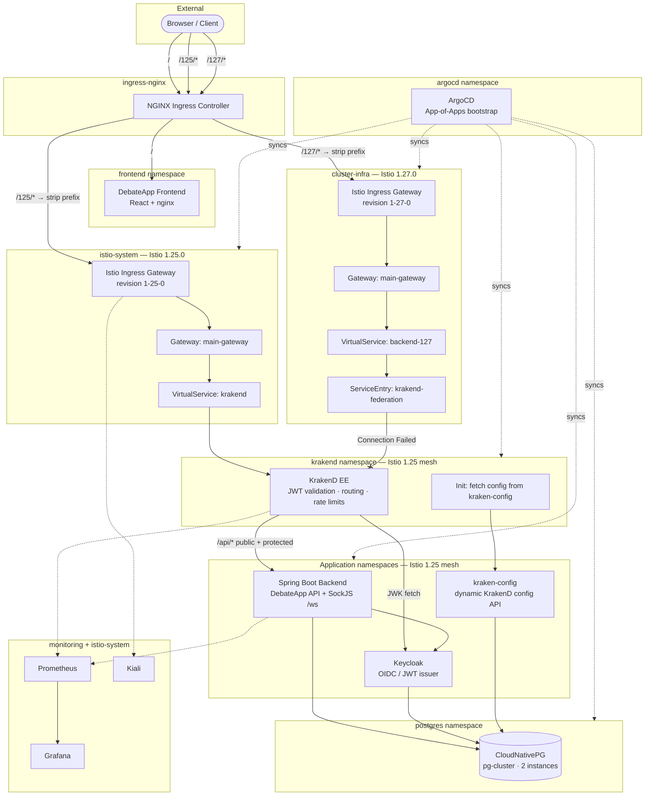

# Kubernetes Service Mesh with Istio and KrakenD API Gateway

A production-style Kubernetes platform that runs **DebateApp** (React frontend + Spring Boot backend) behind **KrakenD EE**, **Istio**, **Keycloak**, and **ArgoCD GitOps**. The stack demonstrates zero-trust mesh networking, JWT validation at the API gateway, dual Istio control-plane revisions, and full declarative deployment.

## Architecture Overview

Traffic enters through **NGINX Ingress**, which fans out to the SPA, two Istio ingress gateways (different mesh revisions), and the rest of the platform.


```mermaid
flowchart TB
    subgraph External
        User([Browser / Client])
    end

    subgraph Ingress["ingress-nginx"]
        NGX[NGINX Ingress Controller]
    end

    subgraph Frontend["frontend namespace"]
        FE[DebateApp Frontend<br/>React + nginx]
    end

    subgraph Istio125["istio-system — Istio 1.25.0"]
        IGW125[Istio Ingress Gateway<br/>revision 1-25-0]
        GW125[Gateway: main-gateway]
        VS125[VirtualService: krakend]
    end

    subgraph Istio127["cluster-infra — Istio 1.27.0"]
        IGW127[Istio Ingress Gateway<br/>revision 1-27-0]
        GW127[Gateway: main-gateway]
        VS127[VirtualService: backend-127]
        SE[ServiceEntry: krakend-federation]
    end

    subgraph Gateway["krakend namespace — Istio 1.25 mesh"]
        KGD[KrakenD EE<br/>JWT validation · routing · rate limits]
        KC[Init: fetch config from kraken-config]
    end

    subgraph Apps["Application namespaces — Istio 1.25 mesh"]
        BE[Spring Boot Backend<br/>DebateApp API + SockJS /ws]
        KCfg[kraken-config<br/>dynamic KrakenD config API]
        KCloak[Keycloak<br/>OIDC / JWT issuer]
    end

    subgraph Data["postgres namespace"]
        CNPG[(CloudNativePG<br/>pg-cluster · 2 instances)]
    end

    subgraph GitOps["argocd namespace"]
        Argo[ArgoCD<br/>App-of-Apps bootstrap]
    end

    subgraph Observability["monitoring + istio-system"]
        Prom[Prometheus]
        Graf[Grafana]
        Kiali[Kiali]
    end

    User -->|"/"| NGX
    User -->|"/125/*"| NGX
    User -->|"/127/*"| NGX

    NGX -->|"/"| FE
    NGX -->|"/125/* → strip prefix"| IGW125
    NGX -->|"/127/* → strip prefix"| IGW127

    IGW125 --> GW125 --> VS125 --> KGD
    IGW127 --> GW127 --> VS127 --> SE --x|Connection Failed| KGD

    KC --> KCfg
    KGD -->|"/api/* public + protected"| BE
    KGD -->|JWK fetch| KCloak
    BE --> KCloak
    BE --> CNPG
    KCloak --> CNPG
    KCfg --> CNPG

    Argo -.->|syncs| Istio125
    Argo -.->|syncs| Istio127
    Argo -.->|syncs| Gateway
    Argo -.->|syncs| Apps
    Argo -.->|syncs| Data

    KGD -.-> Prom
    BE -.-> Prom
    IGW125 -.-> Kiali
    Prom --> Graf
```

### Layered responsibilities

| Layer | Component | Role |
| :--- | :--- | :--- |
| Edge | NGINX Ingress | Single cluster entry point; path-based routing to frontend and Istio gateways |
| API gateway | KrakenD EE | Route aggregation, JWT validation (Keycloak), claim propagation, SockJS proxy |
| Service mesh | Istio 1.25 / 1.27 | mTLS, traffic management, dual-revision upgrade pattern |
| Identity | Keycloak | OIDC provider; `debateapp` realm; issues tokens for `debateapp-api` audience |
| Application | DebateApp | Spring Boot backend + React frontend |
| Data | CloudNativePG | HA PostgreSQL for app and Keycloak databases |
| Delivery | ArgoCD | GitOps App-of-Apps; automated sync and self-heal |

---

## Request Flow

### Static UI

```
Browser  →  NGINX (/)  →  frontend:80  →  React SPA
```

The frontend is built with `VITE_API_BASE_URL=/125/api` and `VITE_WS_URL=/125/ws`, so API and WebSocket calls go through the `/125` Istio path by default.

### API traffic (primary path — Istio 1.25)

```
Browser  →  NGINX (/125/*)  →  istio-system/istio-ingressgateway
         →  Gateway main-gateway  →  VirtualService krakend
         →  krakend-svc:80  →  KrakenD EE  →  backend.backend:8093
```

NGINX rewrites `/125/api/debates` to `/api/debates` before forwarding to the Istio gateway.

### API traffic (canary mesh path — Istio 1.27)

```
Browser  →  NGINX (/127/*)  →  cluster-infra/istio-ingressgateway
         →  Gateway main-gateway  →  VirtualService backend-127
         →  ServiceEntry krakend-federation
         →  krakend-svc.krakend.svc (1.25 mesh)  →  backend.backend:8093
```

The 1.27 revision does **not** bypass KrakenD. A `ServiceEntry` in `cluster-infra` federates KrakenD from the 1.25 mesh so both ingress paths share the same API gateway and auth rules.

### Authentication flow

1. **Public routes** (`/api/auth/login`, `/api/auth/register`) pass through KrakenD without JWT validation.
2. **Protected routes** use KrakenD `auth/validator` with Keycloak JWKs:
   - JWK URL: `http://keycloak.keycloak.svc.cluster.local:8080/realms/debateapp/protocol/openid-connect/certs`
   - Audience: `debateapp-api`
3. Validated claims are forwarded as headers: `X-User-Id`, `X-User-Email`, `X-User-Name`.
4. The `Authorization` header is stripped before the request reaches the backend (KrakenD martian modifier).
5. The backend runs with `APP_GATEWAY_AUTH=true` and trusts gateway-injected identity headers instead of re-validating JWTs on every request.

### WebSocket / SockJS

Real-time debate updates use Spring SockJS at `/ws/**`. KrakenD proxies these as transparent HTTP (GET + POST) rather than using the EE native `websocket` namespace. See [k8s/base/infra/krakend/NOTES.md](k8s/base/infra/krakend/NOTES.md) for the full rationale.

---

## Dual Istio Revisions

This project runs **two Istio control planes** in the same cluster to demonstrate safe mesh upgrades.

| Revision | Namespace | Manages namespaces labeled | Ingress prefix |
| :--- | :--- | :--- | :--- |
| **1.25.0** | `istio-system` | `istio.io/rev: 1-25-0` | `/125` |
| **1.27.0** | `cluster-infra` | `istio.io/rev: 1-27-0` | `/127` |

Each istiod uses `discoverySelectors` so it only watches namespaces with its own revision label, reducing control-plane overhead.

**Namespaces on Istio 1.25.0:** `backend`, `krakend`, `kraken-config`, `keycloak`, `istio-system`

**Namespaces on Istio 1.27.0:** `cluster-infra` (gateway + istiod only; app traffic federates back to KrakenD)

To migrate a workload to a new revision, update the namespace label:

```bash
# Move to Istio 1.27.0
kubectl label namespace backend istio.io/rev=1-27-0 --overwrite

# Roll back to Istio 1.25.0
kubectl label namespace backend istio.io/rev=1-25-0 --overwrite
```

---

## Repository Layout

```
k8_istio_krakend/
├── k8s/
│   ├── argocd/                  # App-of-Apps root + ArgoCD Application manifests
│   │   ├── bootstrap.yaml       # Root bootstrap Application
│   │   ├── infra/               # Platform apps (Istio, KrakenD, Keycloak, CNPG, …)
│   │   └── apps/                # Workload apps (backend, frontend, postgres, …)
│   ├── base/                    # Kustomize bases (shared manifests)
│   │   ├── apps/                # backend, frontend, postgres, kraken-config
│   │   └── infra/               # krakend, keycloak, istio, monitoring
│   └── overlays/dev/            # Dev overlay entry points referenced by ArgoCD
├── scripts/
│   ├── install-argocd.sh        # Bootstrap ArgoCD + root Application
│   ├── deploy.sh                # Alternative Helm-based ArgoCD install
│   └── root.yaml                # Bootstrap manifest + repo credentials template
└── README.md
```

ArgoCD Applications point at `k8s/overlays/dev/*` and track the `minimal-work` branch.

---

## Core Components

### KrakenD EE (`krakend` namespace)

- Image: `niteesh20/velonetics:2.2.0`
- Default config in `configmap.yaml`; optionally overridden at startup from `kraken-config:5000/api/krakend-config`
- Init container patches JWK/issuer settings and ensures claim headers are in `input_headers`
- Routes all DebateApp REST endpoints plus SockJS `/ws/*` paths

### Keycloak (`keycloak` namespace)

- Image: `quay.io/keycloak/keycloak:25.0.6`
- Realm `debateapp` imported from `realm-debateapp.json`
- Backed by the `keycloak` database on the shared CNPG cluster

### DebateApp Backend (`backend` namespace)

- Image: `niteesh20/myapp-backend:latest`
- Spring Boot on port `8093`; Istio sidecar injected
- Connects to PostgreSQL (`pg-cluster-rw.postgres.svc:5432/appuser`) and Keycloak

### DebateApp Frontend (`frontend` namespace)

- Image: `niteesh20/myapp-frontend:latest`
- Served at `/` via NGINX Ingress; no Istio sidecar
- API calls target `/125/api`; WebSocket calls target `/125/ws`

### CloudNativePG (`postgres` namespace)

- Operator installed in `cnpg-system`
- `pg-cluster` with 2 instances; databases: `appuser` (app), `keycloak` (identity)

### Observability

- **Prometheus + Grafana** in `monitoring` namespace
- **Kiali** in `istio-system` for service mesh topology and traffic health

---

## Getting Started

### Prerequisites

- Kubernetes cluster v1.28+
- `kubectl`, `helm`, and `base64` installed locally
- Sufficient cluster resources for dual Istio control planes, CNPG, Keycloak, and app workloads

### Installation

1. **Clone the repository**

   ```bash
   git clone https://github.com/niteeshchaudhary/k8_istio_krakend.git
   cd k8_istio_krakend
   ```

2. **Bootstrap ArgoCD and the App-of-Apps root**

   ```bash
   ./scripts/install-argocd.sh
   ```

   This installs ArgoCD via Helm, then applies `k8s/argocd/bootstrap.yaml`, which syncs all platform and application manifests from Git.

3. **Configure the Git repository credential (if needed)**

   If ArgoCD cannot reach the private repo, apply the template in `scripts/root.yaml` (adjust URL and credentials first).

4. **Verify deployment**

   ```bash
   # ArgoCD admin password
   kubectl -n argocd get secret argocd-initial-admin-secret \
     -o jsonpath='{.data.password}' | base64 -d && echo

   # Wait for root apps to sync
   kubectl get applications -n argocd
   ```

   Open the ArgoCD UI (port-forward `argocd-server` if needed) and confirm all Applications are **Synced** and **Healthy**.

### Access paths (after NGINX gets an external IP or port-forward)

| Path | Destination |
| :--- | :--- |
| `/` | DebateApp frontend |
| `/125/api/*` | API via Istio 1.25 → KrakenD → backend |
| `/125/ws/*` | SockJS via Istio 1.25 → KrakenD → backend |
| `/127/api/*` | API via Istio 1.27 → KrakenD (federated) → backend |

Example port-forward for local testing:

```bash
kubectl -n ingress-nginx port-forward svc/ingress-nginx-controller 8080:80
# Frontend:  http://localhost:8080/
# API:       http://localhost:8080/125/api/debates/public
```

---

## ArgoCD Application Map

| Application | Path | Namespace |
| :--- | :--- | :--- |
| `root-bootstrap` | `k8s/argocd` | `argocd` |
| `nginx-ingress` | Helm: ingress-nginx | `ingress-nginx` |
| `istio-infra` | `k8s/overlays/dev/infra/istio` | `istio-system` |
| `istio-infra-v127` | `k8s/overlays/dev/infra/istio-v127` | `cluster-infra` |
| `istio-gateway` | Helm: gateway 1.25.0 | `istio-system` |
| `istio-gateway-v127` | Helm: gateway 1.27.0 | `cluster-infra` |
| `krakend-gateway` | `k8s/overlays/dev/infra/krakend` | `krakend` |
| `keycloak` | `k8s/overlays/dev/infra/keycloak` | `keycloak` |
| `cnpg-infra` | `k8s/overlays/dev/infra/cnpg` | `cnpg-system` |
| `monitoring` | `k8s/overlays/dev/infra/monitoring` | `monitoring` |
| `kiali-infra` | `k8s/overlays/dev/infra/kiali` | `istio-system` |
| `backend-app` | `k8s/overlays/dev/apps/backend` | `backend` |
| `frontend-app` | `k8s/overlays/dev/apps/frontend` | `frontend` |
| `postgres-app` | `k8s/overlays/dev/apps/postgres` | `postgres` |
| `kraken-config-app` | `k8s/overlays/dev/apps/kraken-config` | `kraken-config` |

---

## Monitoring and Maintenance

- **Kiali** — service graph, mTLS status, request error rates (Istio 1.25 mesh)
- **Grafana** — cluster, KrakenD, and Istio metrics dashboards
- **CloudNativePG** — use the [`kubectl-cnpg`](https://cloudnative-pg.io/documentation/current/kubectl-plugin/) plugin for backups, failover, and cluster status

---

## Secret Management

### Current strategy (development)

Secrets (PostgreSQL credentials, Keycloak admin, client secrets) are generated inline via Kustomize `secretGenerator` literals for simplicity.

> **CAUTION:** Hardcoded secrets in Git are not suitable for production.

### Production recommendation

Use an external secret store (HashiCorp Vault, AWS Secrets Manager, GCP Secret Manager) integrated via the [External Secrets Operator](https://external-secrets.io/) so credentials never live in Git and can be rotated automatically.

---

## Related Documentation

- [KrakenD SockJS / WebSocket routing notes](k8s/base/infra/krakend/NOTES.md)
- [DebateApp backend](../DebateApp/) — Spring Boot application source
- [Istio revision-based upgrade docs](https://istio.io/latest/docs/setup/upgrade/canary/)
